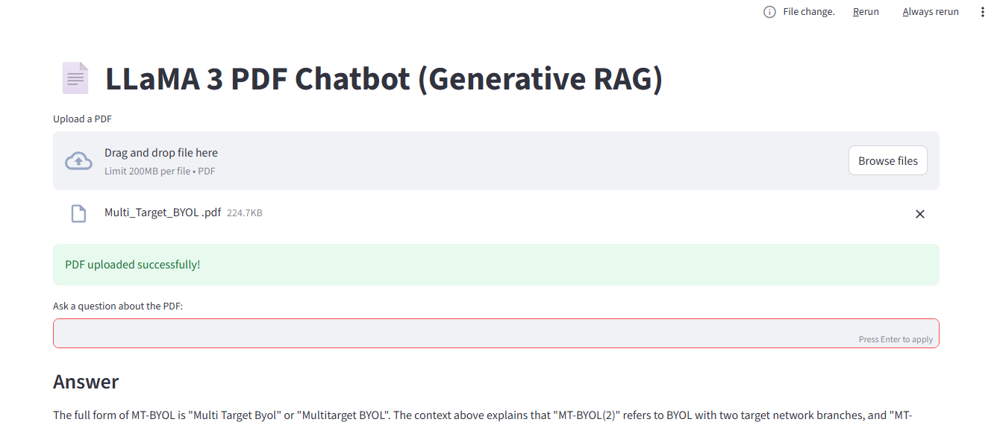

# 📄 PDF RAG Chatbot 

A **Retrieval-Augmented Generation (RAG)** chatbot that answers questions from PDF documents using a **local LLM (TinyLlama via Ollama)**, **FAISS vector search**, and **SentenceTransformers embeddings**.

This project demonstrates an **end-to-end GenAI pipeline** with semantic search, context grounding, and ***low-memory optimization*** for local deployment.

---

## 🚀 Features

- 📂 Upload any PDF and ask questions
- 🔍 Semantic search using FAISS
- 🧠 Context-aware answers using RAG
- 🤖 Local LLM inference with Ollama (TinyLlama)
- 💬 Chat history in UI
- ⚡ Cached embeddings and index for performance
- 🧮 Low-RAM optimization (small chunks + limited context)

---

## 🏗️ Architecture Diagram 

                ┌──────────────┐
                │   User UI    │
                │  (Streamlit) │
                └──────┬───────┘
                       │
                       ▼
               ┌──────────────┐
               │   PDF Upload │
               └──────┬───────┘
                      ▼
               ┌──────────────┐
               │ Text Chunking│
               └──────┬───────┘
                      ▼
        ┌────────────────────────────┐
        │ SentenceTransformers       │
        │   (Embeddings)             │
        └──────────┬─────────────────┘
                   ▼
             ┌───────────┐
             │   FAISS    │
             │ Vector DB  │
             └────┬───────┘
                  ▼
          Top-K Relevant Chunks
                  ▼
           ┌──────────────┐
           │  TinyLlama   │
           │  (Ollama)    │
           └────┬─────────┘
                ▼
           Grounded Answer


---

## 🛠️ Tech Stack

- **LLM:** TinyLlama (via Ollama)
- **Embeddings:** sentence-transformers (all-MiniLM-L6-v2)
- **Vector DB:** FAISS
- **Frontend:** Streamlit
- **PDF Parsing:** pypdf
- **Language:** Python

---

## 🎥 Chatbot Demo



----

## ⚙️ Setup Instructions


### 1. Clone the Repository

```bash
git clone https://github.com/<your-username>/pdf-rag-chatbot.git
cd pdf-rag-chatbot
```


### 2. Create Virtual Envirenment
```bash
python -m venv venv
venv\Scripts\activate
```

### 3. Install Dependencies
```bash
pip install -r requirements.txt
```

### 4. Install and Run Ollama
```bash
ollama pull tinyllama
```
### 5. Run the Streamlit App
```bash
streamlit run pdf_chatbot_streamlit_app.py
```
